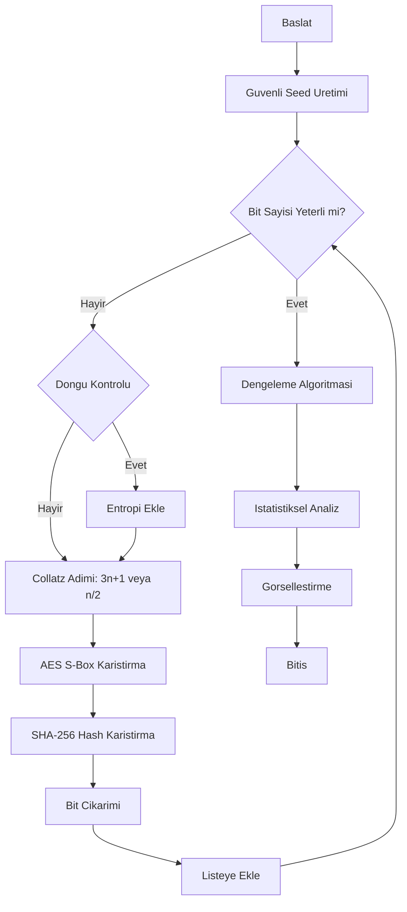
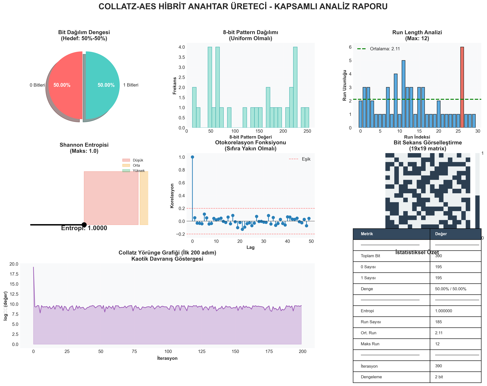
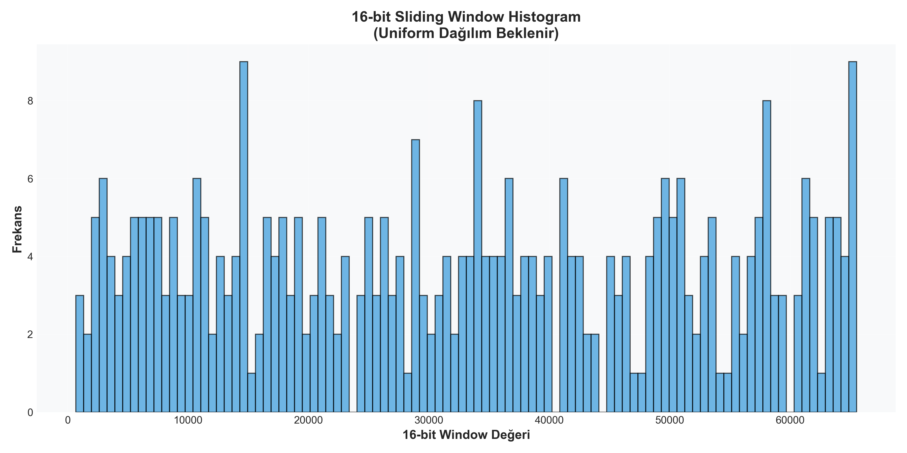
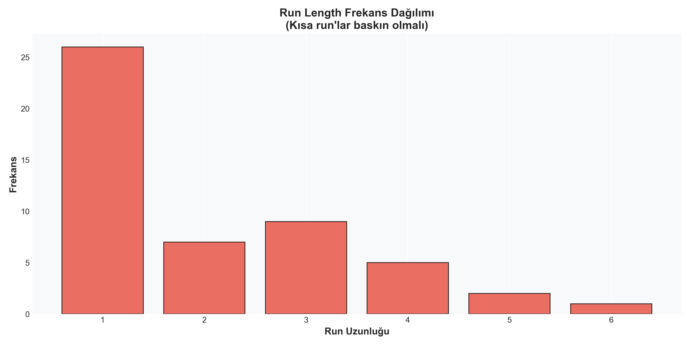

# Collatz-AES Hibrit Anahtar Üreteci

**Bilgi Sistemleri Güvenliği Dersi - Özel Araştırma Projesi**

Bu proje, kaotik matematik (Collatz Problemi) ve modern kriptografik teknikleri (AES S-Box) birleştirerek yüksek güvenlikli ve istatistiksel olarak dengeli rastgele anahtarlar üretir.


---

## Proje Amacı

Standart rastgele sayı üreteçlerinin ötesine geçerek, kaotik dinamikler ve doğrusal olmayan dönüşümlerle tahmin edilmesi zor anahtarlar üretmek. Sistem, üretilen her anahtarın %50 sıfır ve %50 bir içermesini garanti eder (Mükemmel Denge).

## Özellikler

- **Hibrit Yapı:** Collatz kaosu ve AES S-Box/Inverse S-Box karıştırması.
- **Tam Denge:** Üretilen anahtarlarda 0 ve 1 sayısı her zaman eşittir.
- **Yüksek Entropi:** Shannon entropisi > 0.99.
- **Görsel Analiz:** Detaylı histogramlar, run testleri ve denge grafikleri.
- **Güvenli Başlangıç:** Python `secrets` modülü ile CSPRNG tabanlı seed.

## Algoritma Akış Şeması

Aşağıdaki şema, anahtar üretim sürecinin mantıksal akışını göstermektedir:



## Kurulum ve Kullanım

### Gereksinimler

- Python 3.8+
- matplotlib, numpy

### Kurulum

```bash
git clone https://github.com/username/collatz-aes-generator.git
cd collatz-aes-generator
pip install -r requirements.txt
```

### Çalıştırma

```bash
python main.py
```

Program çalıştığında anahtar uzunluğunu (örn. 256) girin. Sonuçlar terminalde ve `output/` klasöründe görüntülenecektir.

## Analiz ve Görseller

Algoritma, üretilen anahtarların kalitesini kanıtlamak için çeşitli grafikler oluşturur.

### 1. Kapsamlı Analiz Raporu
Denge, entropi, otokorelasyon ve run testlerini içeren genel bakış:



### 2. Bit Dağılımı ve Histogram
Bitlerin uniform dağılımını gösteren grafikler:



### 3. Run Length Analizi
Ardışık gelen bitlerin (000, 111 gibi) frekans analizi:



## Dosya Yapısı

- `collatz_aes.py`: Ana algoritma ve sınıf yapısı.
- `analysis.py`: Grafik oluşturma ve istatistiksel test modülü.
- `main.py`: Kullanıcı arayüzü ve çalıştırıcı.
- `output/`: Oluşturulan grafiklerin kaydedildiği klasör.

## Lisans

Bu proje eğitim amaçlı geliştirilmiştir. Akademik kullanımlarda kaynak gösteriniz.
